# API Monitoring Project Architecture

The runtime has two separate agents. The collector polls the JSONL log every 30 seconds and appends unseen records to one CSV. The dashboard agent watches that CSV and atomically replaces one HTML dashboard when new information arrives.

```mermaid
flowchart LR
    Log["API JSONL log"] -->|"poll every 30 seconds"| Collector["Collector agent<br/>agent/monitor.py"]
    Collector -->|"append unseen records"| CSV["runtime/logs.csv<br/>cumulative source of truth"]
    CSV -->|"watch for changes"| Dashboard["Dashboard agent<br/>agent/dashboard.py"]
    Dashboard -->|"atomic update"| HTML["reports/ecommerce-mock-api/dashboard.html"]
    HTML -->|"HTTP on localhost:8000"| Browser
    Browser -->|"background fetch every 2 seconds"| HTML
```



Each CSV row has a SHA-256 `record_id`. This lets the collector safely reread the source after restarts or log rotation without duplicating records. Frequently queried values have dedicated columns; `raw_json` preserves the complete original record.

The dashboard processes `http_request` rows into three fronts: a plain-language business view, an engineering view with full error evidence, and a structured JSON payload for downstream agents. It presents cumulative request counts, success and error rates, p50/p95/p99 latency, status totals, errors, routes, and the latest 100 requests. It never reads the JSONL input directly. Its local HTTP page fetches changed content in the background, so the browser does not reload.

## Runtime

```bash
./scripts/run_monitor.sh
```

The script starts both agents, stops both when interrupted, and uses these defaults:

- Source: `error_generator/logs/api.jsonl`
- CSV: `runtime/logs.csv`
- HTML: `reports/ecommerce-mock-api/dashboard.html`
- Collector interval: 30 seconds
- Dashboard watcher interval: 2 seconds

For deterministic one-shot execution:

```bash
python3 agent/monitor.py --once
python3 agent/dashboard.py --once
```
